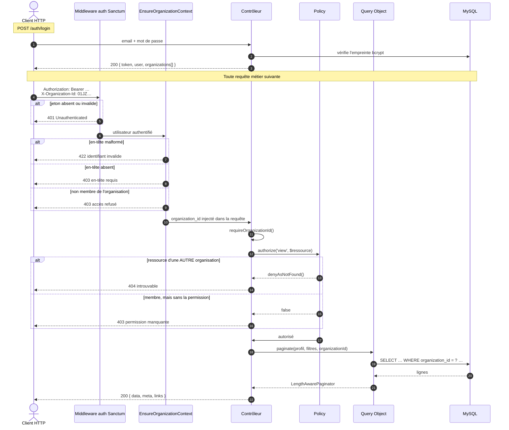
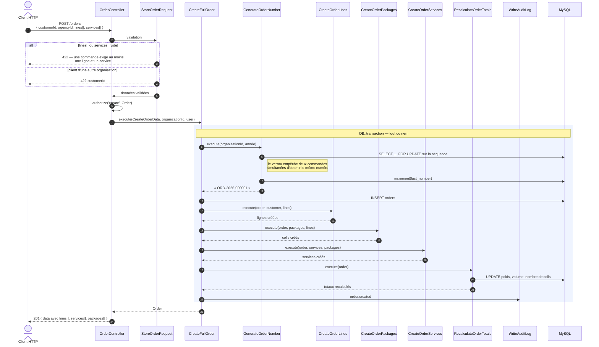
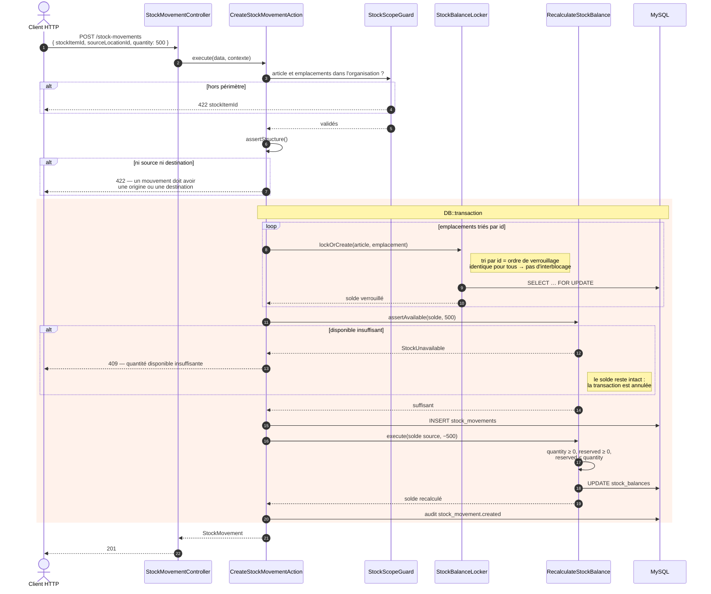
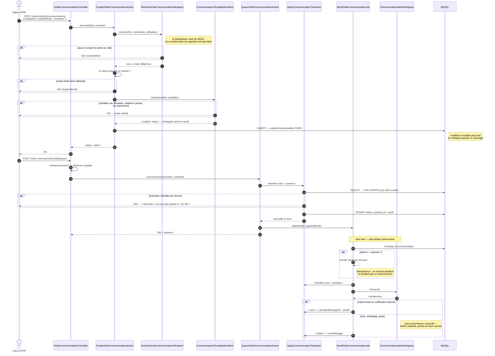
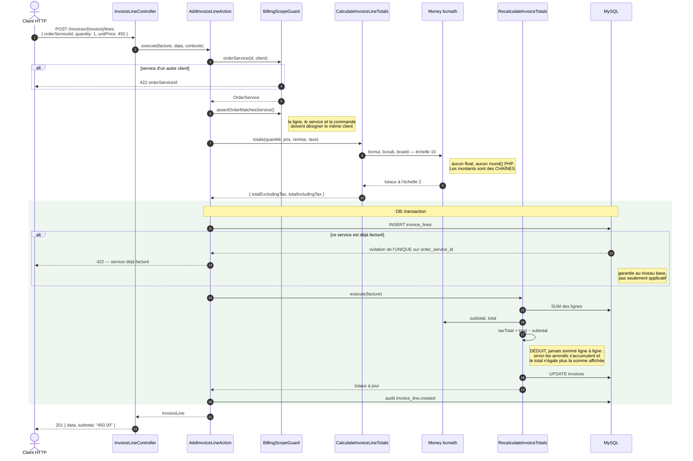

# Tricolis V2 — Diagrammes de séquence

Cinq séquences tirées du **code réel** : chaque classe nommée ici existe, chaque
refus décrit est vérifié par un test. Elles couvrent les cinq mécaniques qui se
répètent partout ailleurs — sécurité, écriture transactionnelle, concurrence,
asynchrone, et calcul monétaire.

Les diagrammes sont en Mermaid : GitHub les affiche nativement.

---

## 1. Authentification et périmètre organisationnel

**La séquence que traverse chacune des 296 routes métier.** Tout le reste en
dépend : c'est ici que se décide qui voit quoi.

### Le point à retenir

Les deux refus **ne se ressemblent pas, et c'est délibéré** :

| Situation | Réponse | Ce que l'appelant apprend |
|---|---|---|
| Membre, sans la permission | `403` | « demande `customers.update` à ton administrateur » |
| Ressource d'une autre organisation | `404` | rien — l'existence de l'identifiant n'est pas confirmée |

Cinq Policies renvoyaient `403` dans le second cas jusqu'à la Phase 10. C'était
un oracle d'énumération : un attaquant testant des ULID au hasard apprenait
lesquels étaient valides ailleurs dans le système.

---

## 2. Création d'une commande complète

**Une commande, ses lignes, ses colis et ses services en un seul appel.** C'est
le modèle de toute écriture composite du projet : une Action orchestre, une
transaction englobe, un seul audit conclut.

### Le point à retenir

Le numéro de commande est **attribué par le serveur, sous verrou**. `firstOrCreate`
ne suffisait pas : deux requêtes concurrentes peuvent toutes deux constater
l'absence de la séquence et tenter de la créer. Le code gère explicitement cette
collision.

Si l'une des quatre sous-actions échoue, **rien ne subsiste** — pas de commande
orpheline sans ligne, pas de numéro consommé pour rien.

---

## 3. Mouvement de stock — la concurrence

**Deux sorties simultanées sur le même article ne doivent pas passer sous zéro.**
C'est le cas où l'ordre des opérations décide de la justesse du résultat.

### Le point à retenir

Trois protections se cumulent, et aucune ne remplace les autres :

1. **le verrou** (`SELECT … FOR UPDATE`) sérialise les demandes concurrentes ;
2. **le tri par identifiant** avant verrouillage évite l'interblocage — deux
   transferts croisés A→B et B→A prendraient leurs verrous dans le même ordre ;
3. **`RecalculateStockBalance`** refuse tout solde négatif, même si la
   vérification amont a été franchie.

Le solde n'est jamais écrit à la main : il est **produit par les mouvements**.
C'est pourquoi `stock_balances` n'a ni route de création ni route de
modification.

---

## 4. Communication — du modèle à l'envoi

**La seule séquence asynchrone du projet.** Elle montre comment le contenu est
figé, comment la file est déclenchée, et pourquoi un double envoi est impossible.

### Le point à retenir

`ApplyCommunicationTransition` **relit le statut en base après avoir pris le
verrou**, jamais depuis l'instance en mémoire. C'est ce qui rend l'envoi
idempotent : un second `dispatch` du même job trouve la communication déjà
partie et s'arrête.

Trois canaux échouent volontairement. Un transporteur qui retournerait « succès »
sans rien envoyer marquerait `SENT` un message qui n'existe pas — pire qu'une
absence annoncée.

---

## 5. Facturation d'un service — l'argent

**Un service exécuté devient une ligne de facture, une seule fois.** La séquence
montre où passent les montants et pourquoi ils ne sont jamais des flottants.

### Le point à retenir

Deux garanties qu'il faut lire ensemble :

- **`order_service_id` est UNIQUE** sur `invoice_lines` **et**, indépendamment,
  sur `provider_settlement_lines`. Un service se facture une fois au client et
  se décompte une fois au fournisseur — les deux contraintes ne sont pas liées,
  puisqu'un même service peut être les deux.
- **`taxTotal = total − subtotal`**, déduit et non additionné. Sommer les taxes
  ligne à ligne accumule un arrondi par ligne, et le total cesse d'égaler la
  somme des deux autres nombres affichés au client.

Les montants restent des **chaînes** de la base jusqu'au JSON : `"450.00"`,
jamais `450.0`. Le frontend ne doit pas les convertir en `Number` — ce serait
réintroduire exactement l'erreur que `bcmath` évite côté serveur.

---

## Ce que ces cinq séquences ne montrent pas

| Absent | Où c'est décrit |
|---|---|
| Génération du fichier d'export | `phase-8-final-report.md` — aucune règle de contenu définie |
| Déclenchement automatique des règles | `phase-9-final-report.md` — aucun événement métier émis |
| Callback fournisseur | `phase-9-final-report.md` — aucune intégration existante |
| Portails client, fournisseur, chauffeur | `phase-10-final-report.md` §26 bis — second backend |
